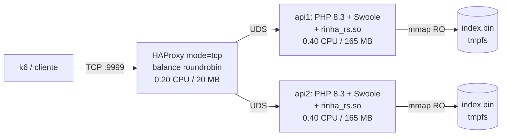
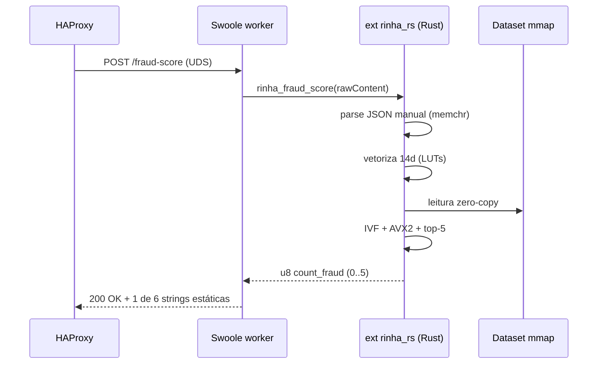

# Fraud Score MVP Design

**Spec:** `.specs/features/fraud-score-mvp/spec.md`
**Status:** Draft

---

## Architecture Overview

A solução tem três camadas em containers separados, comunicando-se exclusivamente por **Unix Domain Sockets em tmpfs** para eliminar o overhead de TCP loopback (~40–60 µs por requisição na CPU Haswell de avaliação). O caminho hot é 100% Rust executando dentro do processo PHP via extensão Zend nativa carregada com `ext-php-rs`.



Pipeline por requisição (apenas API):



Decisões arquiteturais-chave:

- **PHP fora do hot path:** Swoole apenas faz `accept`, lê o `rawContent` e devolve a resposta. Toda a lógica está no Rust. PHP funciona como um adaptador HTTP para a extensão Zend.
- **Extensão Zend, não FFI:** chamada nativa pela tabela de funções do Zend, ~30 ns de overhead em vez de ~1–3 µs do `php-ffi`.
- **Índice mmap:** `index.bin` é mmapeado uma vez por worker em modo `MAP_SHARED|MAP_POPULATE`, residente na RAM do container e zero-copy nas leituras AVX2.
- **Respostas estáticas:** apenas 6 saídas possíveis. Ambos PHP e Rust mantêm a mesma tabela; PHP devolve direto sem `json_encode`.
- **HAProxy `mode tcp`:** round-robin puro, sem parsear HTTP. Aderente à regra de "LB sem lógica".

---

## Code Reuse Analysis

Como projeto greenfield, a maior parte do "reuso" vem da inspiração e leitura cuidadosa dos dois vencedores existentes no diretório.

### Reference Implementations to Study

| Arquivo | Propósito | Como aproveitar |
|---|---|---|
| `rinha-2026-rust/src/build_index.rs` | k-means k=4096 + serialização IVF | **Portar 1:1**, mantendo o mesmo layout binário (`IVF1` magic, blocos de 8 vetores SoA i16). |
| `rinha-2026-rust/src/knn.rs` | IVF k-NN AVX2 + threshold pruning + nprobe fallback | **Portar 1:1** para `rust-ext/src/knn.rs`, ajustando apenas a interface (entrada `&[f32; 14]` em vez de query global). |
| `rinha-2026-rust/src/json.rs` | Parser JSON manual com `memchr` | **Portar com adaptações** para o payload da Rinha (campos diferentes do projeto original; conferir `API.md`). |
| `rinha-2026-rust/src/vector.rs` | Vetorização 14d + LUTs | **Portar 1:1** com adaptação de `mcc_risk` (incluir como dado embeddado em build-time). |
| `rinha-2026-rust/src/data.rs` | mmap do index.bin com `OnceLock` | **Portar com adaptação** para inicializar via `php_module_init` (extensão Zend). |
| `rinha-2026-rust/src/response.rs` | Tabela de 6 respostas estáticas | **Portar e duplicar em PHP** para evitar custo de retorno de string do Rust. |
| `rinha-2026-rust/Cargo.toml` (profile.release) | Flags de release agressivas | **Reaproveitar:** `lto = "fat"`, `codegen-units = 1`, `panic = "abort"`, `strip = true`. |
| `rinha-2026-rust/haproxy.cfg` (n/a, eles usam custom LB) | — | Vamos escrever do zero baseado em docs do HAProxy 2.9. |

### External Dependencies

| Dependência | Versão | Uso |
|---|---|---|
| `ext-php-rs` | `^0.12` | Macros `#[php_function]`, `#[php_module]` e build da extensão Zend. |
| `mimalloc` | `0.1` | Allocator global do crate (reduz fragmentação em alocações pontuais). |
| `memchr` | `2` | `memmem` no parser JSON. |
| `libc` | `0.2` | `mmap`, `munmap`, `madvise(MADV_WILLNEED)`, `mlock` opcional. |
| `flate2` | `1` (apenas no `build_index`) | Descompressão de `references.json.gz`. |
| `serde`, `serde_json` | (apenas no `build_index`) | Parse do JSON gigante uma única vez em build-time. |

### Integration Points

| Sistema | Método de integração |
|---|---|
| `docker-compose.yml` da Rinha (oficial) | Conformidade com a regra de bridge + soma de limites. |
| `test/test.js` (k6) | Reusar para tuning local; **nunca** alimentar o índice. |
| `resources/*.json{.gz}` do repo oficial | Copiar via `COPY` no Dockerfile do `index-builder`. |
| `php.ini` do Swoole | Carregar `extension=rinha_rs.so` antes do listener. |

---

## Components

### LoadBalancer (HAProxy)

- **Purpose:** Aceitar TCP em `:9999` e distribuir round-robin entre os UDS dos 2 backends.
- **Location:** `haproxy.cfg` + serviço `lb` no `docker-compose.yml`.
- **Interfaces:**
  - `frontend rinha_in` — `bind *:9999`, `mode tcp`, `default_backend rinha_apis`.
  - `backend rinha_apis` — `mode tcp`, `balance roundrobin`, `server srv1 unix@/sockets/api1.sock` e `server srv2 unix@/sockets/api2.sock`.
- **Dependencies:** `haproxy:2.9-alpine` (público), volume `sockets` (tmpfs).
- **Reuses:** padrão de UDS upstream do `rinha-2026-rust/docker-compose.yml`.
- **Atende:** TOPO-03, TOPO-04.

### PhpSwooleServer

- **Purpose:** Aceitar HTTP no UDS, rotear `/ready` e `/fraud-score`, delegar para a extensão Rust e devolver string estática.
- **Location:** `php/server.php`.
- **Interfaces:**
  - `on('request', $req, $resp)` — único handler.
  - Ambiente: `SOCK` (caminho do UDS), `INDEX_PATH`.
- **Dependencies:** PHP 8.3, ext-swoole 5.x, `rinha_rs.so`.
- **Reuses:** padrão de servidor UDS minimalista.
- **Atende:** FRAUD-01, READY-01, READY-02, EDGE-01.

Configuração:

```
SWOOLE_BASE, worker_num=1, reactor_num=1,
open_tcp_nodelay=true (sem efeito em UDS, defensivo),
log_level=ERROR,
buffer_output_size=2KB
```

### RustExtension `rinha_rs`

- **Purpose:** Expor para PHP a função `rinha_fraud_score(body: string): int` que devolve `count_fraud ∈ 0..=5`.
- **Location:** `rust-ext/` (cdylib produz `rinha_rs.so`).
- **Interfaces:**
  - `#[php_function] pub fn rinha_fraud_score(body: &[u8]) -> u32`
  - `#[php_module]` registra a função no boot da extensão; `php_module_init` chama `data::init()` (mmap) e `knn::warmup()` (toca páginas).
- **Dependencies:** Zend ABI (PHP 8.3), `rinha_rs/data`, `rinha_rs/json`, `rinha_rs/vector`, `rinha_rs/knn`.
- **Reuses:** estrutura de módulos do `rinha-2026-rust/src/`.
- **Atende:** FRAUD-01..05, EDGE-02..06.

Submódulos:

| Submódulo | Responsabilidade |
|---|---|
| `data.rs` | mmap do `INDEX_PATH`, parsing do header `IVF1`, exposição de `Dataset` global. |
| `json.rs` | Parser manual (memchr::memmem) extraindo campos do payload em uma struct intermediária `&[u8]`-friendly. |
| `vector.rs` | Vetorização 14d com LUTs estáticas (`hour 0..=23`, `weekday 0..=6`, `installments 0..=12`, `tx_count 0..=20`, MCC risk via match). |
| `knn.rs` | `knn5_fraud_count(query, ds)` — IVF + AVX2 + top-5 + threshold pruning + fallback nprobe=24. |
| `response.rs` | (pequeno) constantes/tabelas espelho — usado se um futuro request handler em Rust for adicionado. |

### IndexBuilder (build-time only)

- **Purpose:** Ler `references.json.gz` (3M vetores f32) e produzir `index.bin` no formato IVF embeddado.
- **Location:** `rust-build/src/build_index.rs` (binário separado, não vai para a imagem final).
- **Interfaces:**
  - CLI: `build_index <references.json.gz> <out.bin>`.
- **Dependencies:** `flate2`, `serde_json`, threads para Lloyd em paralelo.
- **Reuses:** `rinha-2026-rust/src/build_index.rs` 1:1.
- **Atende:** BUILD-01, BUILD-02.

Layout produzido (mesmo do 2º colocado):

```
[ "IVF1"           u8[4]                               ]
[ n: u32            (total vetores)                    ]
[ k: u32            (4096 centroides)                  ]
[ d: u32            (14)                               ]
[ centroids[d * k] : f32   SoA, c[d*k + ci]            ]
[ block_offsets[k+1] : u32 (em blocos de 8 vetores)    ]
[ labels[padded_n] : u8                                ]
[ blocks[total_blocks][14*8] : i16  SoA dim×slot, scale 1e-4 ]
```

---

## Data Models

### `Dataset` (Rust, runtime)

```rust
#[repr(C)]
pub struct Dataset {
    pub k: usize,                  // 4096
    pub n: usize,                  // ~3_000_000
    pub centroids: &'static [f32], // len = d*k, SoA
    pub offsets:   &'static [u32], // len = k+1
    pub labels:    &'static [u8],  // len = padded_n
    pub blocks:    &'static [i16], // len = total_blocks*112 (14 dim * 8 slots)
}
```

Inicializado via `OnceLock<Dataset>` no `php_module_init` (uma vez por processo).

### Payload extraído (Rust, por request, em stack)

```rust
pub struct Tx<'a> {
    pub amount: f32,
    pub installments: u32,
    pub hour: u8,         // 0..=23
    pub weekday: u8,      // 0..=6
    pub minutes_since_last: i32, // -1 se null
    pub km_from_last: f32,       // -1.0 se null
    pub km_from_home: f32,
    pub avg_amount: f32,
    pub tx_count_24h: u32,
    pub known_merchants: &'a [u8],
    pub merchant_id: &'a [u8],
    pub mcc: &'a [u8],
    pub merchant_avg_amount: f32,
    pub is_online: bool,
    pub card_present: bool,
}
```

Toda a struct vive em stack — zero alocação por request.

### Tabela de respostas (PHP e Rust, espelho)

```
0 fraudes → "{\"approved\":true,\"fraud_score\":0.0}"
1 fraude  → "{\"approved\":true,\"fraud_score\":0.2}"
2 fraudes → "{\"approved\":true,\"fraud_score\":0.4}"
3 fraudes → "{\"approved\":false,\"fraud_score\":0.6}"
4 fraudes → "{\"approved\":false,\"fraud_score\":0.8}"
5 fraudes → "{\"approved\":false,\"fraud_score\":1.0}"
```

---

## Algorithm: IVF k-NN

Idêntico ao `rinha-2026-rust/src/knn.rs`. Resumo do pipeline `knn5_fraud_count`:

1. **Distância query→centroides** (k=4096, d=14) com AVX2/FMA, ~17 µs.
2. **top-N por nprobe** com `partition_point` + `rotate_right` (insertion sort O(N²) é ok para N=8 ou 24).
3. **Pass rápido com `nprobe=8`:** varredura dos blocos selecionados, AVX2 fmadd em 14 dims × 8 slots, top-5 com **threshold pruning** após dim 8.
4. **Decisão preliminar:** contar labels==fraud nos top-5.
5. **Se contagem ∈ {2,3} (zona ambígua):** refazer com `nprobe=24` (mais 16 clusters). Mantém detecção robusta sem custo no caso comum.
6. **Retorna `count_fraud: u32`** para o PHP.

Observação: a varredura é determinística — ordem de blocos fixa por `block_offsets`. Empates em distância são quebrados pela ordem de inserção (estável).

---

## Error Handling Strategy

| Cenário de erro | Tratamento | Impacto na submissão |
|---|---|---|
| Body vazio ou JSON malformado irreparável | Retornar `200 OK` com `{"approved":true,"fraud_score":0.0}` (peso `FP=1` ou `TN=0`, melhor do que `Err=5`). | Pior caso: 1 ponto FP por requisição. |
| Campo numérico ausente | Usar `0.0` como default e seguir. | Pode gerar FP/FN; mensurado em tuning. |
| MCC desconhecido | Default `0.5` (FRAUD-05). | Comportamento esperado pela spec. |
| `last_transaction: null` | `-1.0` em índices 5/6 (FRAUD-03). | Comportamento esperado pela spec. |
| `index.bin` ausente ou magic inválido | `php_module_init` chama `eprintln!` e retorna falha → PHP não inicia. | Container reinicia até o operador corrigir; `/ready` nunca responde 200. |
| Falha de mmap (memória) | Mesma resposta acima. | Idem. |
| Conexão UDS quebrada mid-response | Swoole loga em `ERROR`, segue para o próximo accept. | Sem impacto. |

---

## Tech Decisions

| Decisão | Escolha | Justificativa |
|---|---|---|
| Bridge PHP↔Rust | `ext-php-rs` (extensão Zend) | Overhead ~30 ns vs. ~1–3 µs do `php-ffi`; crítico para p99=1 ms (D1). |
| LB | HAProxy 2.9 mode tcp + UDS | Imagem oficial pública, leve, comprovada. Sem inspeção de payload (D2). |
| Algoritmo k-NN | IVF (k=4096, nprobe=8/24) AVX2 i16 | Mesma receita do 2º colocado; perf comprovada (D3). |
| Dataset | 3M completo no v1 | Maximiza qualidade de detecção; subamostragem é fallback (D4). |
| LB↔API | UDS em tmpfs | -40~60 µs/req vs. TCP loopback (D5). |
| Base image | `php:8.3-cli-bookworm-slim` (glibc) | `ext-php-rs` + Swoole pré-compilado mais estáveis em glibc (D6). |
| Swoole mode | `SWOOLE_BASE`, 1 worker | Evita overhead de IPC do master process; CPU já distribuída via 2 APIs (D7). |
| Quantização | i16, scale 1e-4 | Mesma do 2º colocado; reduz banda de memória pela metade vs f32. |
| `target-cpu` | `haswell` (`+avx2,+fma,+bmi2`) | Hardware oficial é Haswell; AVX-512 indisponível. |
| OPcache JIT | `tracing` com 32 MB | PHP só faz roteamento; JIT remove overhead do dispatch. |

---

## Performance Budget (p99 = 1000 µs)

| Etapa | Orçamento (µs) | Observação |
|---|---|---|
| Kernel TCP recv + HAProxy roundrobin | 80 | TCP entrada + UDS saída (HAProxy é O(1)). |
| Swoole accept + parse HTTP minimal | 100 | UDS reduz para ~30–50 µs em workloads leves. |
| Bridge PHP→Rust | 1 | Chamada Zend nativa. |
| Parser JSON manual | 30 | Padrão observado nos vencedores. |
| Vetorização 14d (LUTs) | 5 | Operação trivial. |
| IVF: dist a centroides AVX2 | 20 | k=4096, d=14. |
| IVF: top-N por dist | 5 | N=8. |
| Scan blocos (nprobe=8 ≈ 600 vetores) | 200 | AVX2 fmadd + threshold pruning. |
| Fallback nprobe=24 (raro) | +400 | Só dispara em casos ambíguos. |
| Bridge Rust→PHP + response.end | 60 | Devolver string estática. |
| LB→client (TCP) | 100 | Saída TCP. |
| **Total (caso comum)** | **~600 µs** | Margem para variabilidade. |

Na prática, o p99 do 2º colocado ficou ~0,8 ms; com PHP no loop esperamos +200 µs. O alvo de 1 ms é apertado mas atingível se Swoole/UDS não introduzir surpresas.

---

## Open Questions

- ABI: `ext-php-rs` está em ~0.12; validar suporte oficial a PHP 8.3 (via `Context7` no momento da implementação) antes de fixar versão.
- Swoole oferece o `rawContent()` como `zend_string` reutilizável? Confirmar que conseguimos passar `&[u8]` zero-copy à extensão (caso contrário, há um `memcpy` extra de ~50 ns/KB).
- Pré-aquecimento (warmup) precisa rodar `1000+ queries` antes de aceitar tráfego para que o LRU do CPU se estabilize? — provavelmente sim; vamos rodar warmup no `php_module_init`.
